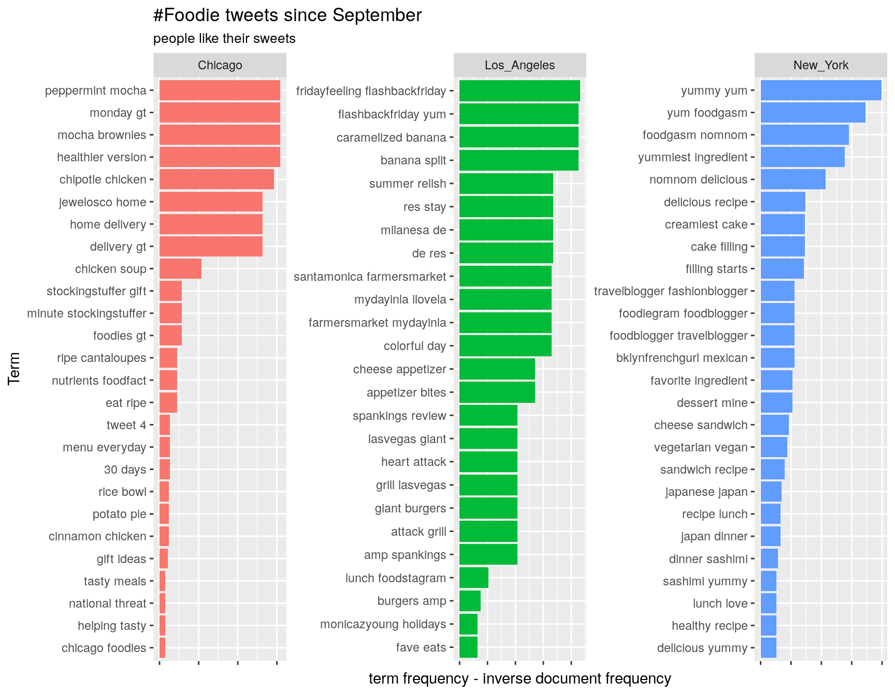

### Background

To practice using the `twitteR` and `tidytext` packages, I wanted to see if I could find regional differences in foodie tweets.  
`twitteR` makes it easy to download tweets by matching the content of the tweet, the location of the tweet or location of the 
user. `tidytext` provides natural language processing tools in an easy 'tidy' format to flow well with the rest of the 
tidyverse. To learn more have a look at [Text Mining with R: A Tidy Approach](https://www.tidytextmining.com/) by Julia Silge 
and David Robinson.  If you're wondering what all the tidy talk is about, have a look at this section from [R For Data 
Science](http://r4ds.had.co.nz/tidy-data.html#tidy-data-1) by Garrett Grolemund and Hadley Wickham.

### Part 1: Start twitteR and find the tweets

Load the libraries into R:

```{r twitter_libraries, echo=TRUE}
library(twitteR)
library(tidyverse)
library(tidytext)
knitr::opts_chunk$set(echo = TRUE, warning = FALSE, message = FALSE)
```


Use twitter API credentials to start session.

```{r API, echo=TRUE, eval=FALSE}
# use your credentials
consumer_key <- CONSUMER_KEY
consumer_secret <- CONSUMER_SECRET
access_token <- ACCESS_TOKEN
access_secret <- SECRET_TOKEN
# lastly start the session
setup_twitter_oauth(consumer_key, consumer_secret, access_token, access_secret)
```

#### Search tweets

`searchTwitter` makes it easy to find tweets. Here I set the search terms to search all tweets containing '#foodie' or 
'#foodies'.  The search is constrained by the `geocode` which is latitude, longitude, and a radius from that location.  The 
results will be tweets that have a location from within that radius *or* tweets by user's whose profile has a location set 
within that radius.

The locations I chose were Chicago, Los Angeles, and New York with a search radius of 20 miles.

```{r geocodes, include=FALSE}
# set search terms
terms <- "#foodie OR #foodies"
# name the cities
cities <- c("Chicago", "Los_Angeles", "New_York")
```

`searchTwitter` also takes an argument `n =` for the number of tweets to return, and in this case I set it to 2000.

```{r cache=TRUE, echo=TRUE}
# find tweets within 20 miles of chicago containing either #foodie or #foodies in English
# name the cities
cities <- c("Chicago", "Los_Angeles", "New_York")
# chicago
chicago <- searchTwitter(terms, n = 2000, lang = 'en',  geocode = "41.881832,-87.623177,20mi", since = "2017-09-01")
# and LosAngeles
la <- searchTwitter(terms, n = 2000, lang = 'en',  geocode = "34.052234,-118.243685,20mi", since = "2017-09-01")
# and New York
nyc <- searchTwitter(terms, n = 2000, lang = 'en',  geocode = "40.7142700,-74.0059700,20mi", since = "2017-09-01")
```

The next step is to tidy up the data.  `twitteR` provides a nice function to convert each list of tweets into a data frame, with `twListToDF`.  

```{r create_DF, echo=TRUE}
# make each a dataframe
tweets.df <- list(chicago, la, nyc) %>% 
  map(twListToDF)
# add city name column to each dataframe
tweets.df <- map2(tweets.df, cities, cbind)
# combine dataframes into a single df
tweets.df <-tweets.df %>% bind_rows()
# rename city col
tweets.df <- rename(tweets.df, City = `.y[[i]]`) %>% 
  select(text, screenName, City)
```

### Part 2: Analyze the text

'Stop words' are words that tend to occur very frequently, but have little to no meaning in the text.  For example 'and' or 'a' 
may occur very frequently in a text but tell us nothing about it.  Let's remove some of these from the tweets prior to 
analyzing.  `tidytext` brings with it a list of 1149 stop-words from three sources, and here I add a few extras that seem to be 
prevalent in these tweets, including the screen names of those tweeting.

```{r add_stop_words, echo=TRUE}
# grab screenNames to add to stop_words list
custom_stop_words <- tibble(word = c(str_to_lower(unique(tweets.df$screenName)),
                                     'rt', 
                                     'food',
                                     'foodie',
                                     'foodporn',
                                     'porn'),
                        lexicon = 'twitter') %>% 
  bind_rows(stop_words)
```

I'm also manually removing any urls from the tweets with `stringr::str_replace`.

```{r clean_tweets, echo=TRUE}
# clean up text to remove urls
clean_tweets.df <- tweets.df %>% 
  mutate(
    Text = text %>% 
      str_replace("http.*", "")
  ) 
```


In order to analyze the messages we first have to tidy the text.  Tidy here means one word per row per city since I want to 
group by city to compare them to each other.  To tidy we can use `unnest_tokens()` which takes arguments for the name of the 
output column, the input column, and in this case I'm making *bigrams* or word-pairs to treat as individual observations.  The 
pairs are then split into two separate columns for cleaning using the 'stop words' list.

```{r bigrams, echo=TRUE}
# tokenize by bigrams
bigrams <- clean_tweets.df %>% 
  unnest_tokens(bigram, Text, token = "ngrams", n = 2) %>% 
  separate(bigram, c('word1', 'word2'), sep = " ") 
```


```{r filter, echo=TRUE}
# filter out the ones that are stop words
bigrams_filtered <- bigrams %>%
  filter(!word1 %in% custom_stop_words$word) %>%  # not word one a stop word
  filter(!word2 %in% custom_stop_words$word)      # not word two a stop word
```

If we had the phrase 'cast iron skillet' we would get both bigrams 'cast iron' and 'iron skillet'.


```{r unite_bigrams, echo=TRUE}
# stick em back together
bigrams_united <- bigrams_filtered %>%
  unite(bigram, word1, word2, sep = " ")
# show top 10
arrange(bigrams_united, desc(bigram)) %>% top_n(10)
```

**tf-idf** term frequency inverse document frequency calculation gives us an idea of which words *characterize* the foodie tweets from each city.  Term frequency is how often the word, or bigram in this case, appears divided by how many total bigrams appear in each collection of tweets.  This is then multiplied by a weighting factor called *inverse document frequency* which is calculated as:

idf(term) = ln(no_of_documents / no_of_documents containing term)

In this case because there are only three cities the idf could be either ln(3/3), ln(3/2) = 0.405, or ln(3/1) = 1.099.  So if we're looking at Chicago and the bigram is 'best pizza' and it shows up 100 times out of 1000 total bigrams in all the Chicago tweets, the term frequency is 0.1.  Now if the bigram 'best pizza' also occurs in both the NY and LA tweets the *inverse document frequency* is then ln(3/3) = 0 so the **tf-idf** for 'best pizza' is 0.1 * 0 = 0.  On the other hand if it was only used in the Chicago set of tweets the .1 would be multiplied by ln(3/1) = 1.099 therefore increasing it's weight.  In this way the calculating the **tf-idf** can help determine which terms (word pairs) characterize the #foodie tweets from each city.


### Part 3: Plot it

```{r bigram_plot, echo=TRUE, fig.height=7, fig.width=9}
bigram_tfidf_plot <- bigram_tf_idf %>% 
  group_by(City) %>% 
  top_n(25) %>% 
  ggplot(aes(fct_reorder(bigram, tf_idf), tf_idf, fill = City)) +
  geom_col(show.legend = FALSE) +
  coord_flip() +
  facet_wrap(~ City, scales = 'free')
# clean up labels
bigram_tfidf_plot +
  labs(
    title = "#Foodie tweets since September",
    subtitle = "people like their sweets"
      ) +
  xlab("Term") +
  ylab("term frequency - inverse document frequency") +
  theme(
    axis.text.x = element_blank()
  )
```

From the bigrams listed for each city we can see a few instances of word pairs appearing twice.  For example "peppermint mocha 
brownies", was split into "peppermint mocha" and "mocha brownies", and "eat ripe cantaloupes" was split into equally popular 
"eat ripe" and "ripe cantaloupes".  The **tf-idf** for each bigram is exactly the same based on the height of the bars for each 
being the same. In Los Angeles we see the same thing happening right at the top of the list, "fridayfeeling flashbackfriday 
yum" and "caramelized banana split".  With a little more analysis and cleaning we could make the picture more clear.


For a quick first pass it looks like in Chicago foodies like their chicken, ripe fruit, potato and rice, but not as much as 
those peppermint mocha brownies.  Los Angeles likes giant burgers, cheese, the farmers market, but not as much as their 
caramelized banana split.  New York is happy about Japanese, cheese sandwich, ingredients, but not as much as their creamiest 
cake filling.  Apparently I'm not the only one with a sweet tooth. 

There are many limitations to this first look at the bigrams tf-idf by city on twitter:

* Tweets that were retweeted may be overestimated, it's easier to retweet and maybe the retweet happened for a reason other 
than the text content, like a picture or one user is a fan of the other

* Analyzing the text for a topic that typically contains a lot of images may miss the subject of the tweet

* Using the geocode limits tweets to those with location tags or user's who specify a location

Limitations aside, the `tidytext` package was my first brief introduction to natural language processing and has opened to me a whole new world of data.
